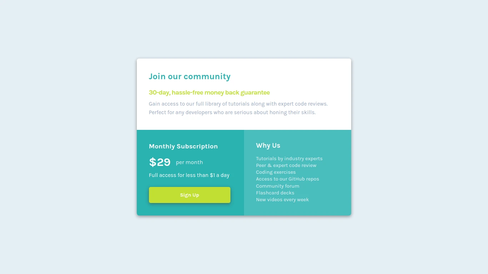

# Frontend Mentor - Single price grid component solution

This is a solution to the [Single price grid component challenge on Frontend Mentor](https://www.frontendmentor.io/challenges/single-price-grid-component-5ce41129d0ff452fec5abbbc). Frontend Mentor challenges help you improve your coding skills by building realistic projects. 

## Table of contents

- [Overview](#overview)
  - [The challenge](#the-challenge)
  - [Screenshots](#screenshots)
  - [Links](#links)
- [My process](#my-process)
  - [Built with](#built-with)
- [Author](#author)

## Overview

### The challenge

Users should be able to:

- View the optimal layout depending on their device's screen size

### Screenshots

- Desktop view

- Mobile view

### Links

- [Fron End Mentor solution](https://www.frontendmentor.io/solutions/single-price-grid-component-ps9SuiWTSu)
- [Live site](https://codepen.io/agusscript/pen/poOXzMa)

## My process

### Built with

- Semantic HTML5 markup
- CSS custom properties
- Flexbox
- Media queries and responsive design

## Author

- Linkedin - [Agustin Emanuel Sanchez](https://www.linkedin.com/in/agustin-emanuel-sanchez-4b2807240/)
- Frontend Mentor - [@agusscript](https://www.frontendmentor.io/profile/agusscript)
- Twitter - [@agus_script](https://twitter.com/agus_script)
